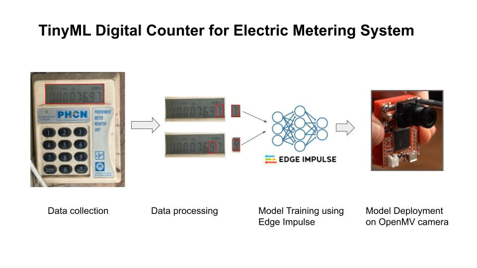
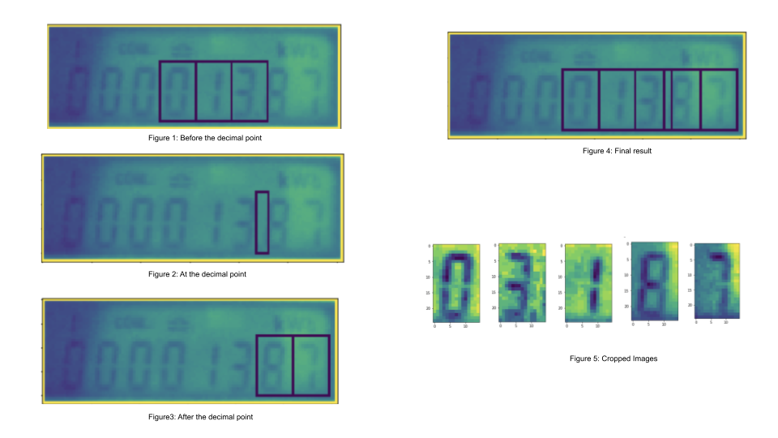
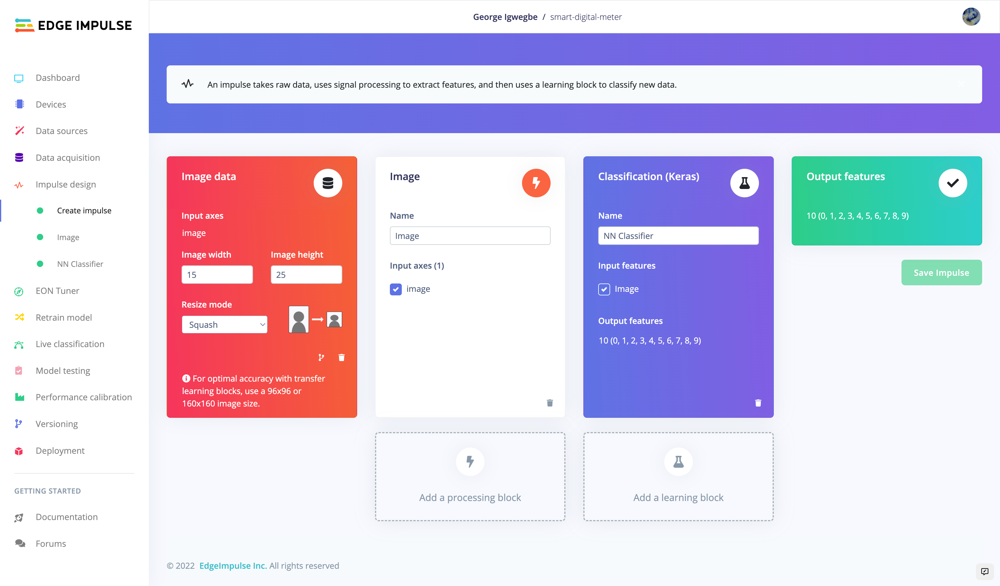
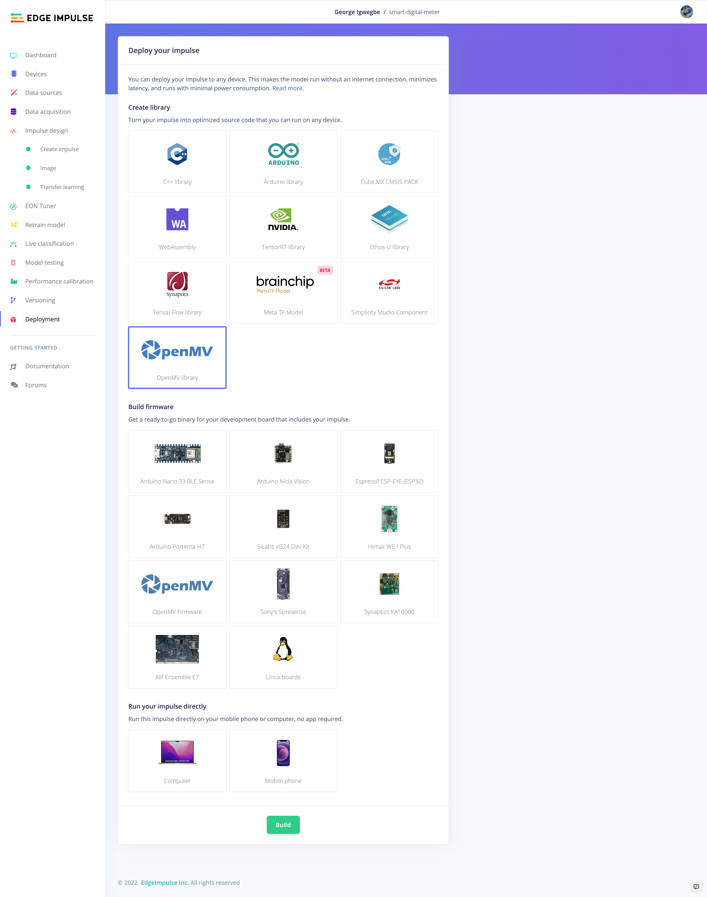

# 
 Tinyml Digital Counter for Electric Metering System 

 The repo contains the codebase for building and deployment of computer vision solution for digitalizing electric meters. 

## 
 Introduction 

## 
 Requirement 

 - Software 
    - [Edge Impulse](edgeimpulse.com)  
 - Hardware 
    - [Openmv Camera H7 Plus](https://openmv.io/collections/products/products/openmv-cam-h7-plus)
    - [Openmv Wifi Shield](https://openmv.io/collections/products/products/wifi-shield-1)

## 
Data Collection 

Run the data collection script [`data_collection_img.py`](https://github.com/gigwegbe/tinyml-digital-counter-for-metering/blob/main/prototype/data_collection_img.py). The script captures images every `snapshot_interval`.  

## 
Data Processing

The captured data is further processed to obtain each digit in each sample image using the following [notebook](https://github.com/gigwegbe/tinyml-digital-counter-for-metering/blob/main/notebook/draw_digit_with_perpective_transform_crop_save_image.ipynb).

## 
 Training 

The cropped images is uploaded the Edge Impulse and a computer vision model was built to recongize digits. 

## 
 Testing 

## 
 Deployment 

## 
 Demo 

<iframe width="560" height="315" src="https://www.youtube.com/embed/Ymdig18wVlM" title="YouTube video player" frameborder="0" allow="accelerometer; autoplay; clipboard-write; encrypted-media; gyroscope; picture-in-picture" allowfullscreen></iframe>

### 
 Future Works 

- Build lighting system for obtaining reading at night
- Deep sleep and energy saving mode
- Alerting system for notification

#
# Others 
- Build a prototype with a basic digital display and if we succeed we can move to the next step
- Collect data from real electric meter
- Process the image and build simple CV model
- Build simple baseline model 
- Improve the baseline model 
- Inteface with LCD module
- Inteface with wifi module