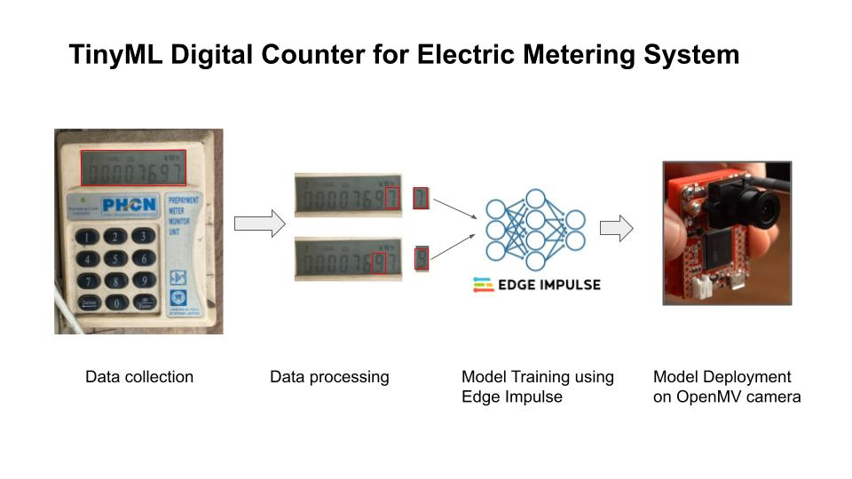

## Tinyml Digital Counter for Electric Metering System
 The repo contains the codebase for building and deployment of computer vision solution for digitalizing electric meters. 

# Introduction

# Requirement 
 - Hardware 
    - Openmv Camera []
 - Software 
    - Edge Impule [] 

# Data Collection 
Run the data collection script [`data_collection_img.py`](https://github.com/gigwegbe/tinyml-digital-counter-for-metering/blob/main/prototype/data_collection_img.py). The script captures images every `snapshot_interval`.  

# Data Processing 
The captured data is further processed to obtain each digit in each sample image using the following [notebook](https://github.com/gigwegbe/tinyml-digital-counter-for-metering/blob/main/notebook/draw_digit_with_perpective_transform_crop_save_image.ipynb).

# Training 
The cropped images is uploaded the Edge Impulse and a computer vision model was built to recongize digits. 

# Testing 

# Deployment 

# Future Works
- Build lighting system for obtaining reading at night
- Deep sleep and energy saving mode
- Alerting system for notification
#
# Others 
- Build a prototype with a basic digital display and if we succeed we can move to the next step
- Collect data from real electric meter
- Process the image and build simple CV model
- Build simple baseline model 
- Improve the baseline model 
- Inteface with LCD module
- Inteface with wifi module