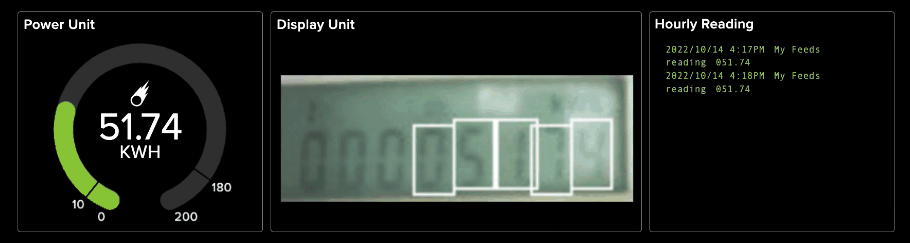

# <center> Tinyml Digital Counter for Electric Metering System </center>
 The repo contains the codebase for building and deployment of computer vision solution for digitalizing electric meters. 

# <center> Introduction </center>


# <center> Requirement </center>
 - Software 
    - [Edge Impulse](edgeimpulse.com)  
 - Hardware 
    - [Openmv Camera H7 Plus](https://openmv.io/collections/products/products/openmv-cam-h7-plus)
    - [Openmv Wifi Shield](https://openmv.io/collections/products/products/wifi-shield-1)

# <center>Data Collection </center>
Run the data collection script [`data_collection_img.py`](https://github.com/gigwegbe/tinyml-digital-counter-for-metering/blob/main/prototype/data_collection_img.py). The script captures images every `snapshot_interval`.  

# <center>Data Processing</center>
The captured data is further processed to obtain each digit in each sample image using the following [notebook](https://github.com/gigwegbe/tinyml-digital-counter-for-metering/blob/main/notebook/draw_digit_with_perpective_transform_crop_save_image.ipynb).

# <center> Training </center>
The cropped images is uploaded the Edge Impulse and a computer vision model was built to recongize digits. 


# <center> Deployment </center>

To use the inference script, provide  the following details in the [`secret.py`](https://github.com/gigwegbe/tinyml-digital-counter-for-metering/blob/main/prototype/secret.py): 
```
user = "" # MQTT username 
password = "" # MQTT password
SSID = ""  # Network SSID
KEY = ""  # Network key
server = "" # MQTT server
```
Run the deployment script [`main.py`](https://github.com/gigwegbe/tinyml-digital-counter-for-metering/blob/main/prototype/main.py). To perform inference. 
## <center> Demo </center>

<p><i>Screen Scraping in Action</i></p>

[](https://www.youtube.com/watch?v=Ymdig18wVlM "Demo video")
<p><i>Demo video</i></p>

# <center> Future Works </center>
- Build lighting system for obtaining reading at night
- Deep sleep and energy saving mode
- Alerting system for notification
