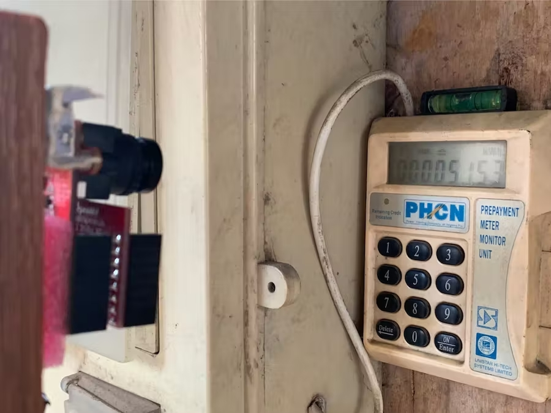
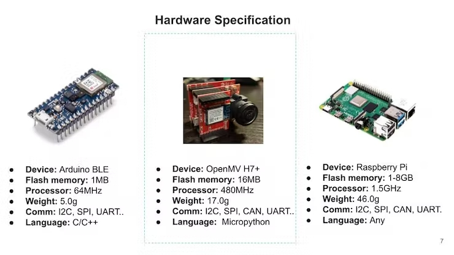
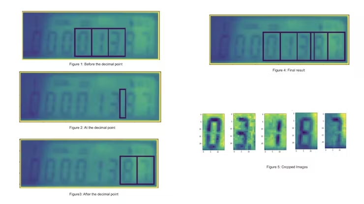
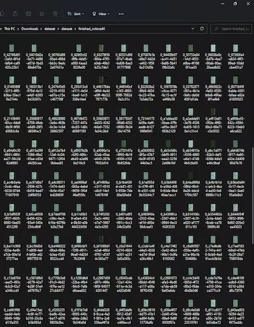

---
Digital Screen Scraping on edge devices
---

# TinyML Digital Counter for Electric Metering System

Created By:
[George Igwegbe](https://www.hackster.io/gigwegbe), [Martins Awojide](https://www.hackster.io/martinsawojide)

Public Project Link:
[GitHub](https://github.com/gigwegbe/tinyml-digital-counter-for-metering)

## Story

Ever had this brilliant idea to sprinkle a dash of IoT on a system only to be stopped in your tracks because the system is from ages bygone? Well, you are not alone in this quagmire, a number of brownfield projects have an all too common constraint. The systems are either from times before the age of the internet or the OEM does not appreciate unsanctioned tinkering in their ‘business’. Throughout the year, I have been pondering on ways to track my power consumption without taking a stroll out of my apartment, drag myself down a flight of stairs and peep, in shock, at the nearly zero credit point left on my pre-paid meter. I really wanted a way to get that data–with less stress and at my beck and call.

Luckily, a form of display is everybody’s fav (Boomers and Gen X’ers alike; the architect of legacy tech) giving us a unique opportunity to grab that all elusive data in a non-intrusive–*and if you go the TinyML fashion, a low-cost solution.* Anyone in the know can affirm that the cost of this approach pales in comparison to the alternative–overhaul of the old system in part or whole.

Most systems provide the output of process parameters in form of a display–analog or digital. [Peter Warden’s blog](https://petewarden.com/2021/02/28/how-screen-scraping-and-tinyml-can-turn-any-dial-into-an-api/) on “How screen scraping and TinyML can turn any dial into an API” provides a brilliant treatise on handling this problem. This work attempts to do for digital displays what [Brandon Satrom](https://www.hackster.io/brandonsatrom/monitor-the-analog-world-with-tinyml-fd59c4) implemented for analog displays albeit with a different setup, hardware and software choices.

<i>Screen Scraping: Analog vs Digital</i>

### Hardware Requirements

- OpenMV H7+ Board w/ Camera
- 18650 Li-ion Cells for Power 
- WiFi Shield for OpenMV H7+ Board
- LCD Shield for OpenMV H7+ Board [Optional]
- WiFi Booster [Optional]
- Balance Charger [Optional]

### Software Requirements

- Edge Impulse Studio
- Adafruit IO [Free Tier]

As we progress, we would be discussing how to:

- Power and setup an edge device of choice and a suitable camera
- Use OpenMV IDE and Micropython to calibrate the camera, set the ROI and capture training data
- Label training data and scenarios to consider based on data captured
- Use Edge Impulse Studio to build an image classification model that detects all 10-digit types
- Setup a device for live capture and image recognition

<i>Project Workflow</i>

The first course of action for this endeavour was to determine the best edge device for the project considering the metering device was at a remote location without an accessible power source. The OpenMV H7+ was drawn from a lot including the Arduino BLE and Raspberry Pi because of its small form factor, relatively low power consumption, quality of camera attachable to the board, compute power and Tensorflow support. It also helps that the OpenMV community provides ample guides for development and troubleshooting.

<i>Top 3 devices for the project</i>

A suitable rig was built to hold the OpenMV board and its power source. I felt it was a prerequisite for the rig to allow for physical adjustment during the initial data capture, guard against tampering, wind interference or parallax–*error as much as possible.*

Luckily, the OpenMV board has a dedicated IDE with sample codes written in python and based on the Micropython codebase. These allowed for quicker tinkering with possibilities with the chosen tools. My first course of action was to calibrate the camera using [this guide](https://learnopencv.com/camera-calibration-using-opencv/) and a custom-made checkered square array printed on a piece of paper. On completing this task, the fish-eye effect on images produced by the OV5640 camera on the board.

Recall that these steps were just necessary to understand the workings of the projects and validate the initial plan for the set goal–*remote data acquisition.* At this point, the images captured were full-blown 15Kb JPEGs of the whole metering setup but we really needed just a shot of the screen of the meter–*the intended Region of Interest (ROI).* My first attempt to snip off the ROI was made using the thresholding feature available on OpenMV IDE but this failed due to difficulty in segregating the screen segment of the image from the chassis and keypad of the meter. My Plan B was a rule-based approach that entailed embedding the coordinates of the screen for a suitable bounding box. The cropped image of the screen was further processed by relative coordinates to segment the digits displayed on the screen–and of course, the decimal point.

<i>Screen Segmentation for Digit Cropping</i>

Having sorted out the process of image capture and cropping for digit recognition, I began the data collection stage of the project. The duration of the collection was based on the constraints namely the battery power of the cells and the board’s internal memory (32Mb). For some reason, my particular board was not accepting an SDCard, and all the scrolling through MicroPython and OpenMV forums did not help! I intentionally placed a limit on data collection to control the quality of images gotten–*which were taken during daytime*–and the mAh value of the power source in use.

The whole data collection process generated 3260 digit data for training. The choice was made to manually label the data set for improved accuracy. I did this by selecting and moving individual images to folders labelled 0 to 9. A verification step was included in the later stage to handle errors in labelling–*FYI, I had 3 labelling errors in all.*

<i>Unlabelled Data in File Explorer</i>

<i>Distribution of Classes of Training Data</i>

At this juncture, it was time to have fun with Edge Impulse Studio. Considering the OpenMV board only supports quantized INT8 models, the training parameters were set accordingly. Next, experimentation on model performance was done with MobileNet with the transfer learning feature. This returned a model with poor F1 score and a miserly 20.2% accuracy. On further research, I discovered that the limitation came from the use of MobileNet as basis of training. MobileNet input size is expected to be 96 x 96 or 160 x 160 for optimal performance. Our input was peculiar (15 x 20) hence I opted for pure vanilla training with a model having three dense layers and this time I had improved results. I retried the training with more epochs for better accuracy and hit 99.8%.

<i>Initial Attempt with MobileNet</i>

<i>Subsequent Attempt with 3 Dense Layers</i>

The model was generated by Edge Impulse Studio in a tflite file format and it was transferred to the OpenMV board on the initial setup rig. Since the metering device was placed at a detached location from the apartment, a WiFi range extender was set up to enable communication between the OpenMV’s WiFi Shield and the platform of choice. Essentially, the OpenMV device which houses the model does the computing and sends the live data via MQTT to a dashboard *(in this case Adafruit IO)* allowing for real-time updates of the credit point pending on the meter. Mission accomplished!

<i>Screen Scraping in Action</i>

## Demo

## Future Work

The idea of this project was to build a working prototype meaning some features were intentionally left out of scope. For a robust build of this project, two features to consider would be:

- Night Time Data Capture and Recognition, and
- A model-based approach to ROI determination and digit segmentation

The former would probably require an LDR, IR Bulb and new classes of digit data to be trained–*if the Infrared approach is adopted*–while the latter requires building a separate model for ROI recognition and cropping.
